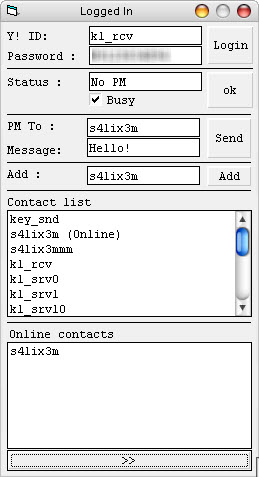



## Yahoo Functions

### Description

This code has some yahoo messenger functions like logging into yahoo id,changing status,sending message to another yahoo id,adding contact,receiving contacts list,receiving online status of contacts,receiving pm or any incoming data.
 
### More Info
 

             |
---                |---
**Submitted On**   |2009-08-30 21:11:50
**By**             |[SaLiXeM](https://github.com/Planet-Source-Code/PSCIndex/blob/master/ByAuthor/salixem.md)
**Level**          |Intermediate
**User Rating**    |3.7 (11 globes from 3 users)
**Compatibility**  |VB 6\.0
**Category**       |[Internet/ HTML](https://github.com/Planet-Source-Code/PSCIndex/blob/master/ByCategory/internet-html__1-34.md)
**World**          |[Visual Basic](https://github.com/Planet-Source-Code/PSCIndex/blob/master/ByWorld/visual-basic.md)
**Archive File**   |[Yahoo\_Func2161348302009\.zip](https://github.com/Planet-Source-Code/salixem-yahoo-functions__1-72416/archive/master.zip)

